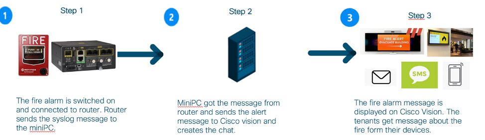
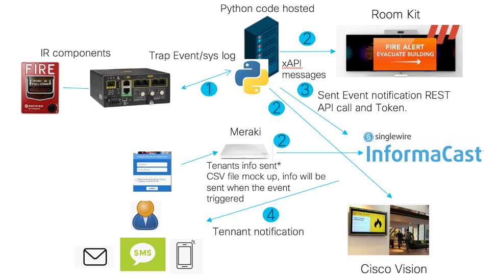
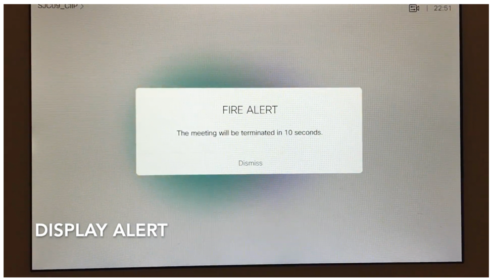
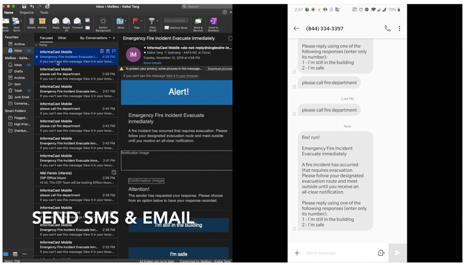
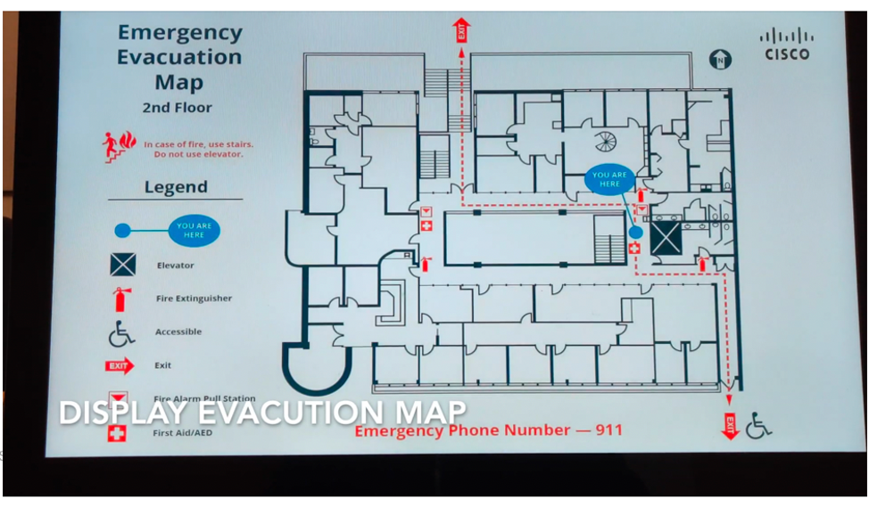
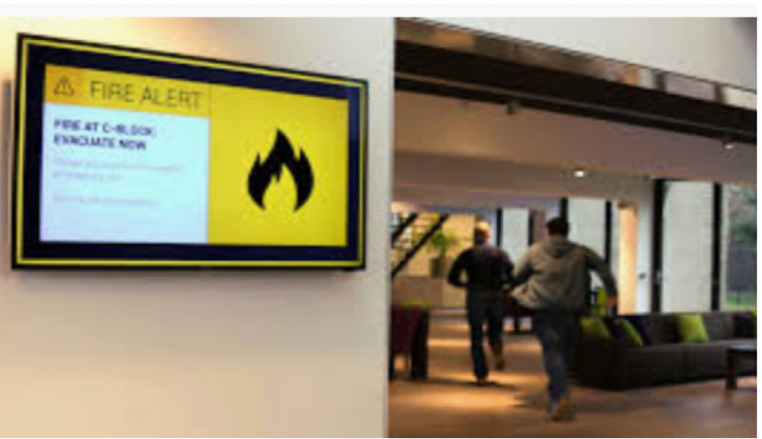

# Smart Building - Fire Alert Use Case

This is a Smart Building Use Case for a more efficient way to handle fire emergency in a work place.


## Contacts
* Alvin Lau (alvlau@cisco.com)
* Gerardo Chaves (gchaves@cisco.com)
* Monica Acosta (moacosta@cisco.com)

## Solution Components
* Cisco Webex Room kit
* Honeywell fire alarm
* Cisco IR1101 router
* Informacast Single wire
* Node.js


## Business Needs and Challenges
- 	Employees in a company do not have proper instructions and efficient coordination during fire emergencies.
- 	The challenge is to create a simpler and automatic way to warn and coordinate tenants in case of a fire emergency.

## Solution

- This demo utilizes Honeywell fire alarm, IR1101 Router, Room Kit, Cisco Vision and Singlewire to create a smart fire safety system which will be used to help tenants evacuate.

## Business Outcomes

- Being more efficient in time to evacuate tenants in case of fire emergency.
- Automation of a process to track safety of tenants in case of fire emergency.

## Customer/Opportunity:
- Customer needs to increase efficiency of tenant evacuation in case of a fire. The fire safety team doesn’t get up to date information about evacuated tenants.

## PoV description:
- Shutdown of all Webex meeting in the building via fire occasion and sends the notification to all tenants in the building via sms, emails and Webex Teams.
-	Then, using Cisco vision displaying evacuation map.
-	The Webex chat bot gets the reply from person when he is evacuated and fire safety team gets up-to-date information about people who left the building.



## Architecture

-	The fire alarm is relayed through the IR1101 router to the server using a Trap event.
-	The code triggers a series of actions which includes stopping ongoing meetings in conference rooms and alerting the occupants, inform all the tenants using Singlewire through SMS and email.

## Launching the PoV:
-	The application is based on NodeJS.
-	Download the code and install all dependencies.
```
git clone <repo>
npm install
```
-	Ensure there is a Webex sandbox available with the room kit under registered in it.
-	Get a Singlewire account. Create a distribution list. Create a message template.
-	Record the message template ID and the distribution list ID.
- Fill the .env files
  1. ROOM_KIT_CONN: "JSXAPI" if the room kit is added as a personal device and you have SSH connection to the room kit; Otherwise, "RESTAPI" for shared device
  2. ROOM_KIT_IP, ROOM_KIT_USERNAME, ROOM_KIT_PASSWORD: only needed when ROOM_KIT_CONN is "JSXAPI"
  3. ACCESS_TOKEN: your Webex access token
  4. SINGLEWIRE_ACCESSTOKEN, SINGLEWIRE_DISTRIBUTION_ID, SINGLEWIRE_MESSAGE_TEMPLATE_ID: you may find it on [Singlewire API Explorer](https://api.icmobile.singlewire.com/api/docs)
-	Run the demo
```
npm start
```
-	And you should see the following screens if everything runs successfully.






### License

Provided under Cisco Sample Code License, for details see [LICENSE](./LICENSE)

### Code of Conduct

Our code of conduct is available [here](./CODE_OF_CONDUCT.md)

### Contributing

See our contributing guidelines [here](./CONTRIBUTING.md)

#### DISCLAIMER:

<b>Please note:</b> This script is meant for demo purposes only. All tools/ scripts in this repo are released for use "AS IS" without any warranties of any kind, including, but not limited to their installation, use, or performance. Any use of these scripts and tools is at your own risk. There is no guarantee that they have been through thorough testing in a comparable environment and we are not responsible for any damage or data loss incurred with their use.
You are responsible for reviewing and testing any scripts you run thoroughly before use in any non-testing environment.

